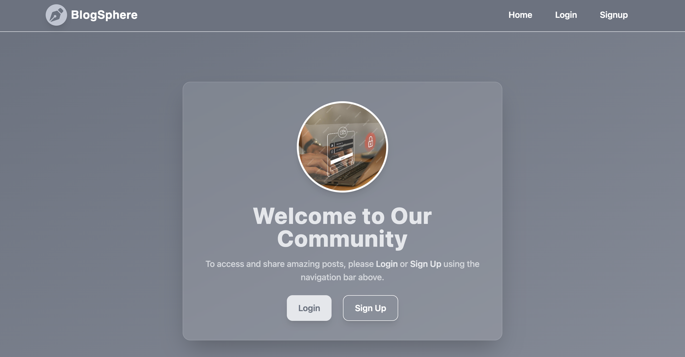
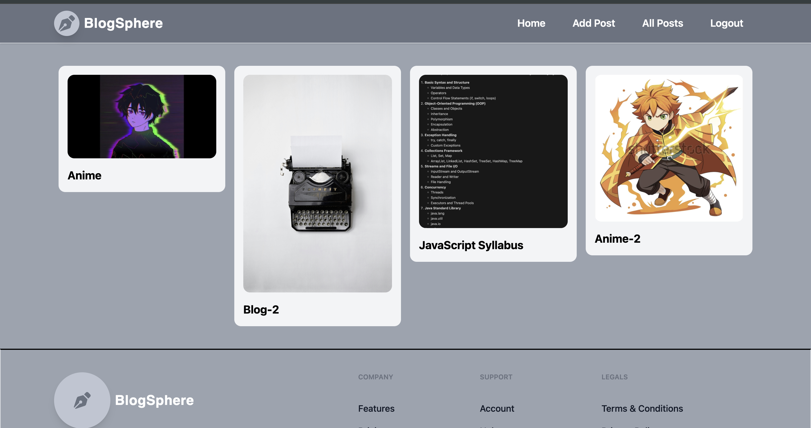
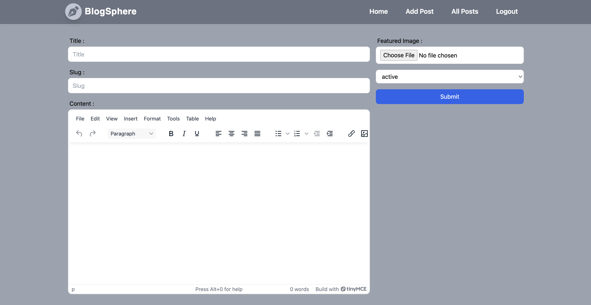

# Appwrite Blog

  
  
  

## Overview

**Appwrite Blog** is a simple and elegant blogging platform built using [Appwrite](https://appwrite.io/), an open-source backend server designed to simplify app development. This project demonstrates how to leverage Appwrite's powerful APIs to create a fully functional blog with user authentication, CRUD operations, and real-time updates.

Whether you're a developer looking to explore Appwrite or someone who wants to build a personal blog, this project provides a solid foundation to get started.

## Features

- **User Authentication**: Secure login and registration using Appwrite's authentication APIs.  
- **CRUD Operations**: Create, Read, Update, and Delete blog posts effortlessly.  
- **Real-Time Updates**: Automatically sync changes across all connected clients.  
- **Responsive Design**: A clean and modern UI that works seamlessly on all devices.  
- **Open Source**: Fully customizable and free to use under the MIT License.  

## Prerequisites

Before you begin, ensure you have the following installed:

- Node.js (v16 or higher)
- Appwrite CLI
- A running instance of Appwrite

## Installation

### Step 1: Clone the Repository

```bash
git clone https://github.com/adityamawa/Appwrite-Blog.git
cd Appwrite-Blog
```

### Step 2: Install Dependencies

```bash
npm install
```

### Step 3: Set Up Appwrite Backend

1. Create a new Appwrite project from the Appwrite Console.
2. Add a **Web** platform in your project settings and configure the redirect URLs.
3. Copy the **Project ID** and **Endpoint URL** from the Appwrite Console.

### Step 4: Configure Environment Variables

Create a `.env` file in the root directory and add the following:

```env
APPWRITE_ENDPOINT=<Your_Appwrite_Endpoint>
APPWRITE_PROJECT_ID=<Your_Project_ID>
```

### Step 5: Run the Application

```bash
npm start
```

The application will be available at [http://localhost:3000](http://localhost:3000).

## Usage

- **Sign Up / Log In**: Register a new account or log in with your credentials.  
- **Create a Post**: Use the "New Post" button to draft and publish your blog post.  
- **Edit/Delete Posts**: Manage your existing posts from the dashboard.  
- **View Posts**: Browse through all published posts on the homepage.  

## License

This project is licensed under the **MIT License**.

## Acknowledgments

- **Appwrite**: For providing a robust backend solution.  
- **The Open-Source Community**: For their continuous support and inspiration.  

